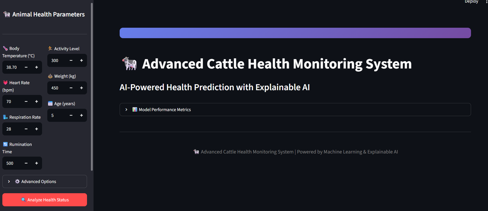
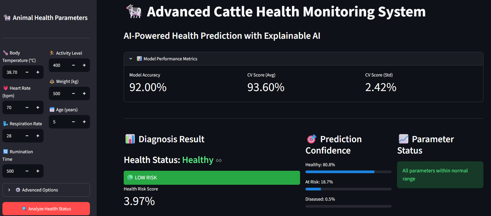
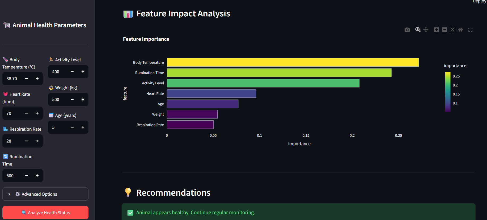

# 🐄 AI Smart Cattle Health Monitoring System

An AI-powered web application developed using **Python, Streamlit, and Machine Learning** to predict cattle health based on physiological parameters. The system uses a **Random Forest Classifier** to classify cattle into **Healthy**, **At Risk**, or **Diseased** categories and provides a health risk score, prediction confidence, feature importance analysis, and health recommendations.


## 📌 Project Overview

Early detection of cattle diseases is essential for improving livestock productivity and reducing economic losses for farmers. Manual health monitoring can be time-consuming and may fail to detect early symptoms.

This project provides an intelligent decision support system that predicts the health status of cattle using machine learning based on physiological parameters.

The application offers an interactive web interface where users can enter cattle health parameters and instantly receive prediction results along with risk assessment and recommendations.


## 🎯 Objectives

- Predict cattle health using Machine Learning.
- Classify cattle into Healthy, At Risk, and Diseased categories.
- Provide real-time health predictions.
- Calculate health risk score.
- Display prediction confidence.
- Visualize feature importance.
- Generate downloadable health reports.


## 🧠 Machine Learning Model

**Algorithm Used**

- Random Forest Classifier

**Classification Type**

- Multi-Class Classification

**Output Classes**

| Class | Meaning |
|--------|----------|
| 0 | Healthy |
| 1 | At Risk |
| 2 | Diseased |


## 📊 Physiological Parameters Used

The prediction is based on the following health parameters:

- 🌡 Body Temperature (°C)
- ❤️ Heart Rate (bpm)
- 🌬 Respiration Rate
- 🔄 Rumination Time
- 🏃 Activity Level
- ⚖ Weight (kg)
- 📅 Age (years)


## ⚙ Features

- Interactive Streamlit Web Application
- Manual Input of Animal Parameters
- Random Forest Classification
- Health Risk Score Calculation
- Prediction Confidence
- Feature Importance Visualization
- Personalized Health Recommendations
- Downloadable Health Report (CSV)


## 📈 Model Workflow

1. Generate synthetic cattle health dataset.
2. Preprocess data using RobustScaler.
3. Train Random Forest Classifier.
4. Evaluate model performance.
5. Accept user input through Streamlit.
6. Predict cattle health.
7. Display prediction confidence.
8. Calculate health risk score.
9. Show feature importance.
10. Generate downloadable report.


## 📐 Mathematical Background

### Random Forest Prediction

\[
\hat{y}=Mode(T_1,T_2,...,T_n)
\]

where

- \(T_i\) = Decision Tree
- Final prediction is the majority vote.


### Accuracy

\[
Accuracy=\frac{TP+TN}{TP+TN+FP+FN}
\]


### Health Risk Score

\[
RiskScore=\sum_{i=1}^{n} w_i x_i
\]

where

- \(w_i\) = Weight of parameter
- \(x_i\) = Normalized physiological value


## 📊 Model Performance

| Metric | Value |
|----------|---------|
| Model | Random Forest |
| Classification | Multi-Class |
| Accuracy | ~92% (Synthetic Dataset) |
| Cross Validation | 5-Fold |
| Dataset | Synthetic (Generated within application) |


## 🛠 Technologies Used

- Python
- Streamlit
- NumPy
- Pandas
- Scikit-learn
- Plotly
- Matplotlib


## 📂 Project Structure

```
AI-Smart-Cattle-Health-Monitoring
│
├── app.py
├── requirements.txt
├── README.md
├── .gitignore
│
└── assets
    ├── logo.png
    ├── home_page.png
    └── prediction_page.png
```

## ▶ Installation

Clone the repository

```bash
git clone https://github.com/jahnavijanu12/AI-Smart-Cattle-Health-Monitoring.git
```

Move into the project

```bash
cd AI-Smart-Cattle-Health-Monitoring
```

Create virtual environment

```bash
python -m venv venv
```

Activate virtual environment

### Windows

```bash
venv\Scripts\activate
```

### Linux / macOS

```bash
source venv/bin/activate
```

Install dependencies

```bash
pip install -r requirements.txt
```

Run the application

```bash
streamlit run app.py
```


## 📷 Application Screenshots

### Home Page




### Prediction Result




### Feature Importance




## 💡 Applications

- Dairy Farms
- Veterinary Clinics
- Livestock Monitoring
- Smart Agriculture
- Animal Research
- Precision Farming


## 🚀 Future Enhancements

- IoT Sensor Integration
- Real-Time Monitoring
- Cloud Database
- Mobile Application
- Deep Learning Models
- Disease-Specific Prediction
- Farmer Notification System


